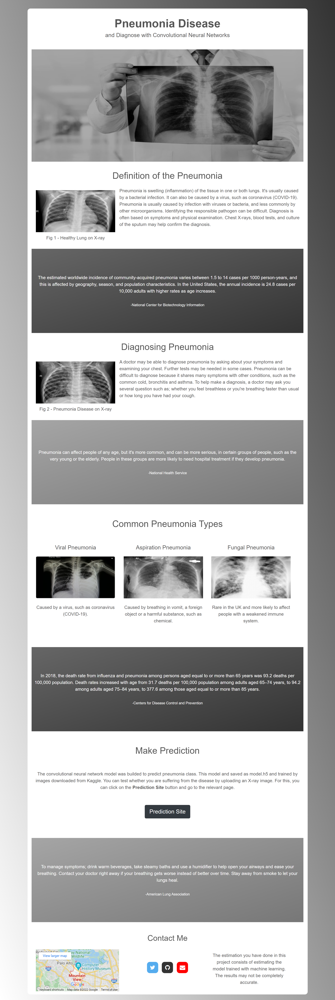
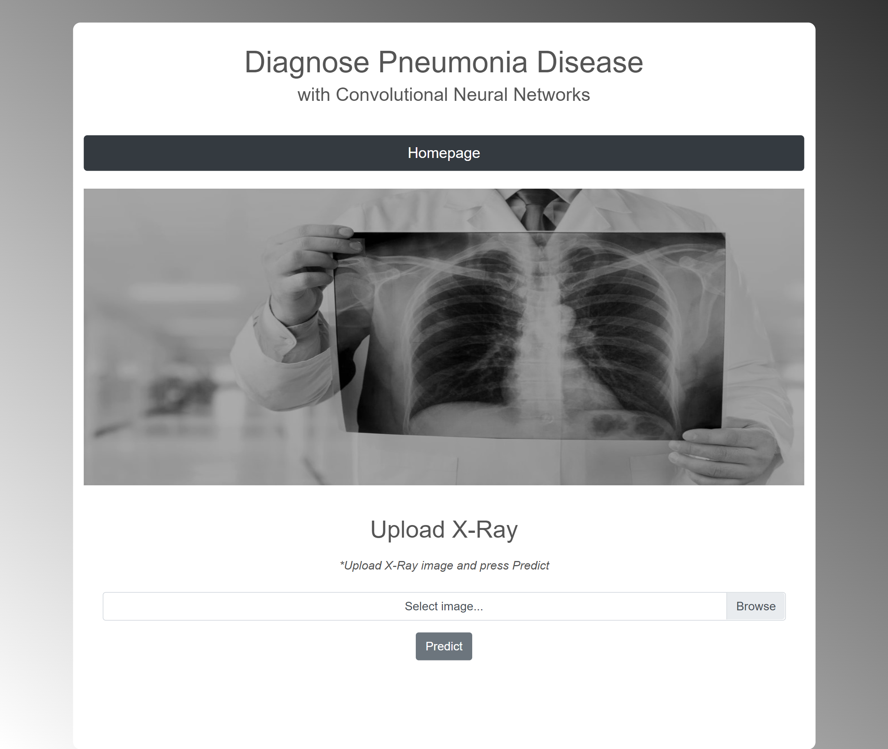

<h1  align=center>New Verison of X-Ray Classification Website with Flask
</h1>

<small>Picture Source:<a  href="https://www.arterys.com/"> arterys.com</a>

 

<h2>Statement</h2>

Within the classification study; there are two different results, in other words, two different output layer results such as <i>PNEUMONIA</i> or <i>NORMAL</i>. Since the study was carried out with a binary dataset, the trained model was compiled with <i>binary_crossentropy</i> loss function. For understanding the methodology you are free to visit the <a  href="https://poloclub.github.io/cnn-explainer/">CNN Explainer</a> website. 

There are lung X-ray images of people suffering from pneumonia and healthy people. The model was developed with the <i>convolutional neural networks</i> method in line with the images downloaded from <a  href="https://www.kaggle.com/paultimothymooney/chest-xray-pneumonia">Kaggle</a>. The web page was created to integrate the created model with the Flask. In addition, it is aimed to give information about the model and disease on the web page. Users will be able to evaluate themselves in line with their knowledge, show their own <i>X-ray</i> images and understand whether they are suffering from the disease. 

Don't you know how to run the flask? Please take a look at <a  href="https://code.visualstudio.com/docs/python/tutorial-flask"> VS Code Website</a>. You can see part 1 of the website in <a  href="https://github.com/doguilmak/X-Ray-Classification-Website-with-Flask">here</a>. Before running the <b>app.py</b>, please check the <b>PATH</b> variable in <b>app.py</b> and make sure that it is pointing right path.

All details are in <b>cheast_cnn.ipynb</b> file.  Convolutional neural network model builded in that file.

 

<h2>Keywords</h2>

<ul>
	<li>Computer Science</li>
	<li>Classification</li>
	<li>Radiography</li>
	<li>X-Ray</li>
	<li>Neural Networks</li>
	<li>Flask</li>
	<li>Pneumonia</li>
</ul>

 

<h2>Dataset</h2>

<h3>Content</h3>

The dataset is organized into 3 folders <i>(train, test, val)</i> and contains subfolders for each image category <i>(Pneumonia/Normal)</i>. There are <i>5,863 X-Ray</i> images <i>(JPEG)</i> and 2 categories </i>(Pneumonia/Normal)</i>.

<i>Chest X-ray</i> images (anterior-posterior) were selected from retrospective cohorts of pediatric patients of one to five years old from <b>Guangzhou Women and Children’s Medical Center, Guangzhou</b>. All chest <i>X-ray</i> imaging was performed as part of patients routine clinical care.

For the analysis of chest <i>X-ray</i> images, all chest radiographs were initially screened for quality control by removing all low quality or unreadable scans. The diagnoses for the images were then graded by two expert physicians before being cleared for training the AI system. In order to account for any grading errors, the evaluation set was also checked by a third expert.

 

<h3>Acknowledgements</h3>

<h4>Data</h4>

You can access data link on following 
<a href="https://data.mendeley.com/datasets/rscbjbr9sj/2">site</a>.

 

<h4>License</h4>

<b>CC BY 4.0</b>

The files associated with this dataset are licensed under a Creative Commons Attribution 4.0 International license.

What does this mean?

You can share, copy and modify this dataset so long as you give appropriate credit, provide a link to the CC BY license, and indicate if changes were made, but you may not do so in a way that suggests the rights holder has endorsed you or your use of the dataset. Note that further permission may be required for any content within the dataset that is identified as belonging to a third party.

   

<h4>Citation</h4> 

You can access citation on following 
<a  href="http://www.cell.com/cell/fulltext/S0092-8674(18)30154-5">site</a>.

 

<h2>Preview</h2>

You can see the preview of the <b>index.html</b> file as <i>2392x7126</i> pixel on the below.

     

You can see the preview of the <b>predict.html</b> file as <i>2392x2020</i> pixel on the below.

     

<h2> Sources</h>

<ol>
	<li><a  href="https://www.ncbi.nlm.nih.gov/books/NBK430749/">NCBI</a></li>
	<li><a  href="https://www.cdc.gov/mmwr/volumes/69/wr/mm6940a5.htm#:~:text=In%202018%2C%20the%20death%20rate,those%20aged%20%E2%89%A585%20years.">CDC</a></li>
	<li><a  href="https://www.lung.org/lung-health-diseases/lung-disease-lookup/pneumonia/treatment-and-recovery">lung.org</a></li>
	<li><a  href="https://www.news-medical.net/image.axd?picture=2020%2F6%2Fshutterstock_786937069.jpg">News Medical </a></li>
	<li><a  href="https://prod-images-static.radiopaedia.org/images/43699885/535686a67c2d7067d080baab6b6b43_jumbo.jpeg">radiopaedia.org</a></li>
	<li><a  href="https://healthjade.net/wp-content/uploads/2019/06/fungal-pneumonia.jpg">healthjade.net</a></li>
</ol>

 

<h2>Contact Me</h2>

If you have something to say to me please contact me:

<ul>
	<li>Twitter: <a  href="https://twitter.com/Doguilmak">Doguilmak</a></li>
	<li>Mail address: doguilmak@gmail.com</li>
</ul>
