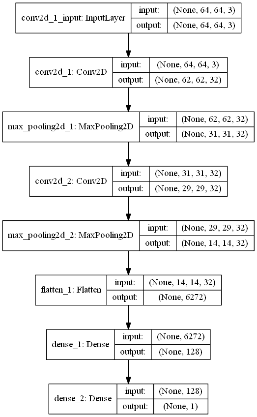

# New Verison of X-Ray Classification Website with Flask

There are lung X-ray images of people suffering from pneumonia and healthy people. The model was developed with the CNNs method in line with the images downloaded from [Kaggle](https://www.kaggle.com/paultimothymooney/chest-xray-pneumonia). The web page was created to integrate the created model with the Flask. In addition, it is aimed to give information about the model and disease on the web page. Users will be able to evaluate themselves in line with their knowledge, show their own x-ray images and understand whether they are suffering from the disease. Don't you know how to run the flask? Please take a look at [VS Code Website](https://code.visualstudio.com/docs/python/tutorial-flask). You can see part 1 of the website in [github.com/doguilmak](https://github.com/doguilmak/X-Ray-Classification-Website-with-Flask).

Before running the **app.py**, please check the **PATH** variable in **app.py** and make sure that it is pointing right path.

## Preview

You can see the preview of the **index.html** file as 2392x7126 pixel on the below.

     

You can see the preview of the **predict.html** file as 2392x2020 pixel on the below.

     

## Dataset

### Content
The dataset is organized into 3 folders (train, test, val) and contains subfolders for each image category (Pneumonia/Normal). There are 5,863 X-Ray images (JPEG) and 2 categories (Pneumonia/Normal).

Chest X-ray images (anterior-posterior) were selected from retrospective cohorts of pediatric patients of one to five years old from Guangzhou Women and Children’s Medical Center, Guangzhou. All chest X-ray imaging was performed as part of patients’ routine clinical care.

For the analysis of chest x-ray images, all chest radiographs were initially screened for quality control by removing all low quality or unreadable scans. The diagnoses for the images were then graded by two expert physicians before being cleared for training the AI system. In order to account for any grading errors, the evaluation set was also checked by a third expert.

### Acknowledgements
Data: https://data.mendeley.com/datasets/rscbjbr9sj/2

License: CC BY 4.0

Citation: http://www.cell.com/cell/fulltext/S0092-8674(18)30154-5

## Methodology

Within the classification study; there are two different results, in other words, two different output layer results such as PNEUMONIA or NORMAL. Since the study was carried out with a binary dataset, the trained model was compiled with **binary_crossentropy** loss function.

For understanding the methodology you are free to visit the [CNN Explainer](https://poloclub.github.io/cnn-explainer/) website. 

Converting CNN keras model (classifier) to dot format and save to a file:

     

val_accuracy:  **0.8845000267028809**

accuracy:  **0.82666665**

**Confusion Matrix**

| 1151 | 190 |
|--|--|
| **409** | **3466** |

## Sources

 - https://www.nhs.uk/conditions/pneumonia/
 - https://www.ncbi.nlm.nih.gov/books/NBK430749/
 - https://www.cdc.gov/mmwr/volumes/69/wr/mm6940a5.htm#:~:text=In%202018%2C%20the%20death%20rate,those%20aged%20%E2%89%A585%20years.
 - https://www.lung.org/lung-health-diseases/lung-disease-lookup/pneumonia/treatment-and-recovery
 - https://www.news-medical.net/image.axd?picture=2020%2F6%2Fshutterstock_786937069.jpg
 - https://prod-images-static.radiopaedia.org/images/43699885/535686a67c2d7067d080baab6b6b43_jumbo.jpeg
 - https://healthjade.net/wp-content/uploads/2019/06/fungal-pneumonia.jpg

## Contact Me

If you have something to say to me please contact me: 

 - Twitter: [Doguilmak](https://twitter.com/Doguilmak)  
 - Mail address: doguilmak@gmail.com
